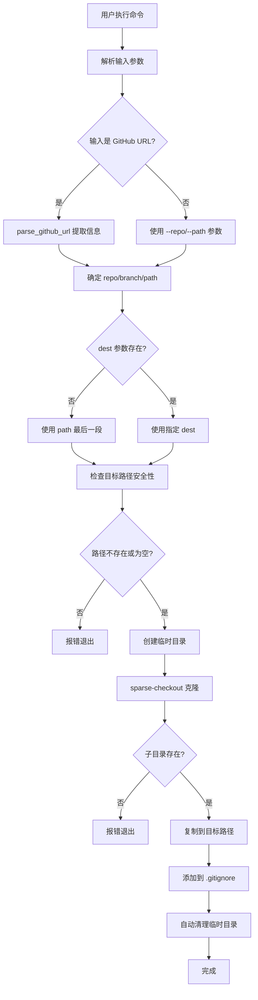
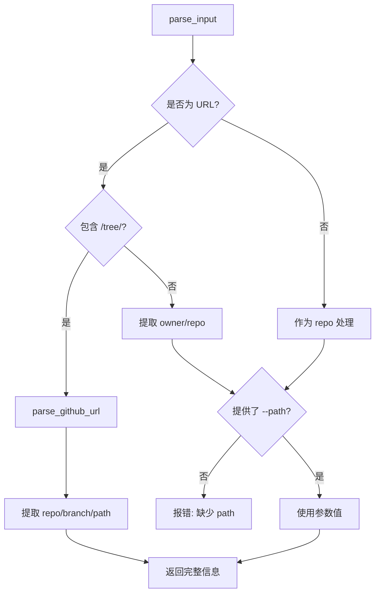
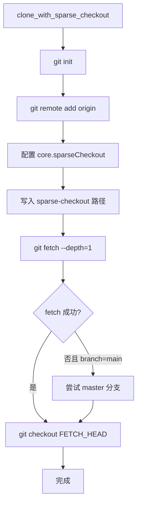

# git-get 功能树

## 1. 功能目录

### [核心] CLI 入口模块
**职责**: 解析命令行参数，协调各功能模块完成子目录抓取任务

| 入口函数 | 说明 |
|---------|------|
| `src/main.rs::main` | 程序入口，错误处理与退出码管理 |
| `src/main.rs::run` | 主业务流程控制器 |
| `src/main.rs::parse_input` | 解析用户输入，支持 URL 或分散参数模式 |

### [核心] URL 解析模块
**职责**: 从 GitHub URL 中提取 repo、branch、path 信息

| 入口函数 | 说明 |
|---------|------|
| `src/main.rs::parse_github_url` | 解析完整的 GitHub URL |
| `src/main.rs::build_repo_url` | 将仓库标识转换为 Git URL |

### [核心] Git 操作模块
**职责**: 封装 git 命令调用，实现 sparse-checkout 克隆

| 入口函数 | 说明 |
|---------|------|
| `src/main.rs::clone_with_sparse_checkout` | 在临时目录执行 sparse-checkout 克隆 |
| `src/main.rs::run_git_command` | 执行 git 子命令并处理结果 |

### [核心] 文件操作模块
**职责**: 目录复制，排除 .git 等元数据

| 入口函数 | 说明 |
|---------|------|
| `src/main.rs::copy_directory` | 复制子目录到目标路径 |
| `src/main.rs::copy_dir_recursive` | 递归复制目录内容 |

### [支撑] .gitignore 管理模块
**职责**: 自动将下载目录添加到 .gitignore

| 入口函数 | 说明 |
|---------|------|
| `src/main.rs::add_to_gitignore` | 检查并添加路径到 .gitignore |

### [支撑] 安全检查模块
**职责**: 确保目标路径安全，防止覆盖已有文件

| 入口函数 | 说明 |
|---------|------|
| `src/main.rs::check_dest_path_safety` | 检查目标路径是否为空或不存在 |

---

## 2. 核心功能实现流程图



---

## 3. 核心功能实现文字说明

### 主流程: 抓取子目录

**触发条件**: 用户执行命令（支持两种方式）
- 方式 1: `git-get https://github.com/owner/repo/tree/branch/path/to/dir`
- 方式 2: `git-get --repo owner/repo --path path/to/dir`

**步骤概述**:
1. **参数解析**: 
   - 使用 clap 解析参数，支持位置参数（URL）或命名参数
   - 优先处理位置参数 URL，其次 `--repo` 参数
2. **输入识别**: 
   - 如果输入包含 `github.com` 和 `/tree/`，调用 `parse_github_url` 提取信息
   - 否则作为 `owner/repo` 格式处理，要求必须提供 `--path` 参数
3. **参数补全**:
   - branch: 未指定时默认 "main"，自动 fallback 到 "master"
   - dest: 未指定时使用 path 的最后一段（如 "examples/servers" -> "servers"）
4. **URL 构建**: 将 `owner/repo` 格式转换为 `https://github.com/owner/repo.git`
5. **安全检查**: 检查目标路径，确保不存在或为空目录，防止覆盖已有文件
6. **临时目录**: 使用 `tempfile::TempDir` 创建临时目录（作用域结束自动清理）
7. **Sparse-Checkout**: 在临时目录初始化仓库，配置 sparse-checkout，拉取指定分支
8. **目录复制**: 递归复制子目录到目标路径，跳过 `.git` 目录
9. **.gitignore 更新**: 自动将目标路径添加到 .gitignore（如果存在）
10. **清理完成**: TempDir drop 时自动清理临时文件

**关键约束**:
- 所有 git 操作仅在临时目录执行，不污染当前项目
- 使用 `--depth=1` 优化，只拉取最新提交
- 分支不存在时自动尝试 fallback 到 master
- 支持从完整 GitHub URL 自动提取所有必要信息
- **安全保护**: 只允许写入不存在的路径或空目录，防止数据损失

**可替换点**:
- Git 操作可替换为 GitHub API + HTTP 下载方式
- 目录复制可替换为 `fs_extra` crate 实现
- URL 解析可扩展支持 GitLab、Bitbucket 等平台

---

## 4. 子功能实现流程图

### URL 解析流程



### Sparse-Checkout 克隆流程



---

## 5. 子功能实现文字说明

### URL 解析

**入口函数**: `parse_input(args) -> (repo, branch, path)`

**关键逻辑**:
1. 优先处理位置参数 URL，其次 `--repo` 参数
2. 检测 URL 是否包含 `github.com/...//tree/...` 格式
3. 如果是完整 URL，调用 `parse_github_url` 提取信息
4. 支持参数覆盖：命令行的 `--branch`/`--path` 优先于 URL 中提取的值

**异常处理**:
- 无任何输入: 显示使用示例
- URL 格式错误: 提示无法解析
- 缺少必要参数: 明确指出缺少哪个参数

**支持的 URL 格式**:
- `https://github.com/owner/repo/tree/branch/path/to/dir`
- `https://github.com/owner/repo/blob/branch/file.txt` (blob 也支持)
- `https://github.com/owner/repo.git` (需额外提供 --path)
- `owner/repo` (需额外提供 --path)

### GitHub URL 解析

**入口函数**: `parse_github_url(url) -> ParsedGitHubUrl`

**关键逻辑**:
1. 以 `github.com/` 为分隔符，提取路径部分
2. 分割路径：`owner/repo/tree|blob/branch/path/segments...`
3. 提取 owner 和 repo（去除 .git 后缀）
4. 如果存在 tree/blob，提取分支和路径

**异常处理**:
- 不包含 github.com: 报错不是有效的 GitHub URL
- 路径段数少于 2: 报错无法提取仓库信息

### Sparse-Checkout 克隆

**入口函数**: `clone_with_sparse_checkout(temp_dir, repo_url, branch, subdir, token)`

**关键逻辑**:
1. 在临时目录初始化空仓库
2. 添加远程仓库地址
3. 启用 sparse-checkout 并写入目标路径
4. 使用 `--depth=1` 浅克隆指定分支
5. 检出 FETCH_HEAD

**异常处理**:
- 仓库不存在: git fetch 失败时返回明确错误
- 分支不存在: 自动尝试 fallback 到 master（仅当指定 main 时）
- 网络错误: 返回 git 命令的原始错误信息

### 目录递归复制

**入口函数**: `copy_dir_recursive(src, dest)`

**关键逻辑**:
- 遍历源目录所有条目
- 跳过名为 `.git` 的目录
- 对子目录递归处理，对文件直接复制

### .gitignore 自动更新

**入口函数**: `add_to_gitignore(dest_path)`

**关键逻辑**:
1. 检查当前目录的 `.gitignore` 文件是否存在
2. 如果不存在，静默返回，不执行任何操作
3. 如果存在，读取文件内容
4. 规范化目标路径（移除开头的 `./`）
5. 检查该路径是否已存在于 .gitignore 中
6. 如果不存在，在文件末尾添加注释和路径
7. 输出日志通知用户

**异常处理**:
- 读取或写入 .gitignore 失败时返回错误
- 已存在的条目不会重复添加

**智能判断**:
- 支持 `./example` 和 `example` 两种格式的重复检测
- 自动规范化为统一格式
- 跳过注释行和空行的检查

### 目标路径安全检查

**入口函数**: `check_dest_path_safety(dest_path, dest_str)`

**关键逻辑**:
1. 如果路径不存在，直接返回（安全）
2. 如果存在但不是目录，报错
3. 如果是目录，检查是否为空
4. 如果目录包含任何内容，报错

**设计意图**:
- 防止用户误操作覆盖已有文件
- 只允许写入空目录或新目录
- 提供清晰的错误提示

**错误示例**:
```
❌ 错误: 目标目录已存在且不为空: ./example
提示: 为了安全起见，git-get 只能写入空目录或不存在的目录
```

---

## 6. 数据结构

### Args (命令行参数)
- **定义位置**: `src/main.rs::Args`
- **用途**: 存储用户输入的命令行参数
- **依赖模块**: CLI 入口模块

| 字段 | 类型 | 说明 |
|------|------|------|
| repo | Option<String> | 仓库标识或 URL |
| branch | Option<String> | 分支名 |
| path | Option<String> | 子目录路径 |
| dest | Option<String> | 目标路径 |
| token | Option<String> | GitHub token |
| url | Option<String> | 位置参数 URL |

### ParsedGitHubUrl (解析后的 URL 信息)
- **定义位置**: `src/main.rs::ParsedGitHubUrl`
- **用途**: 存储从 GitHub URL 中提取的信息
- **依赖模块**: URL 解析模块

| 字段 | 类型 | 说明 |
|------|------|------|
| repo | String | owner/repo 格式 |
| branch | Option<String> | 分支名 |
| path | Option<String> | 仓库内路径 |
